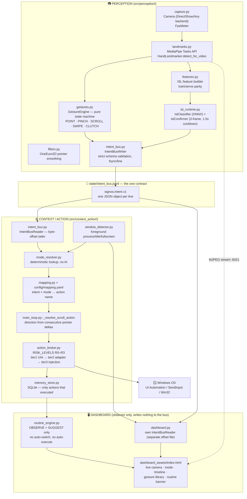
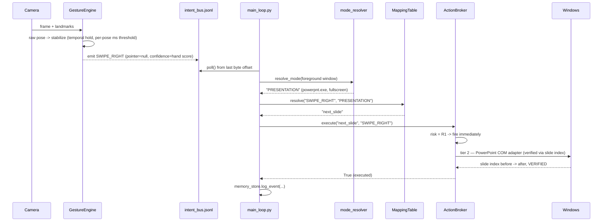
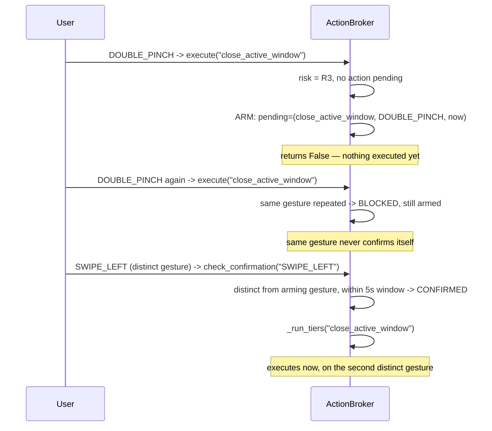
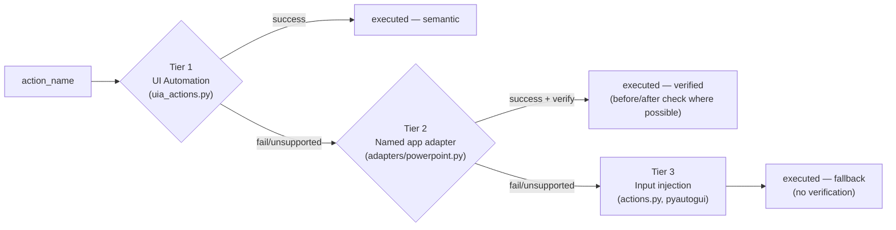

# SIGNOS — Architecture

## Overview

SignOS is split into two independent halves that communicate through exactly one contract: a local, append-only, schema-validated JSON-lines file (`state/intent_bus.jsonl`).

**Perception** (`src/perception/`) turns a webcam feed into structured intent events — direct gestures via a hand-landmark state machine, and (once trained) ISL commands via a temporal ONNX classifier. It never reads window state and never executes anything on the OS.

**Context/Action** (`src/context_action/`) reads intent events, resolves what app/context the user is in, looks up the mapped action, gates it by risk level, and executes it through a three-tier broker. It never touches the camera.

A third, purely observational process — the **Mission Control dashboard** — reads both the intent bus and the local memory store to render a live web UI. It writes to nothing.

This separation means perception can be re-tuned, retrained, or replaced without touching action logic, and vice versa — the only shared surface is the bus schema below.

---

## The Fixed Contract — `signos.intent.v1`

Every line in `state/intent_bus.jsonl` is one JSON object, flushed and `fsync`'d immediately after write. The writer (`src/perception/intent_bus.py`) validates strictly before writing; the reader (`src/context_action/intent_bus.py`) tails from a persisted byte offset and skips any line that isn't schema `signos.intent.v1`, treating a partial/mid-write line as transient, not an error.

```json
{
  "schema": "signos.intent.v1",
  "ts": "ISO8601",
  "id": "uuid4",
  "kind": "gesture | isl",
  "intent": "POINT | PINCH | DOUBLE_PINCH | PINCH_HOLD_MOVE | PINCH_HOLD_STILL |
             SCROLL_V | SCROLL_H | SWIPE_LEFT | SWIPE_RIGHT | PALM_HOLD |
             CLUTCH_ON | CLUTCH_OFF | NONE | TRANSITION | ISL_<NAME>",
  "confidence": 0.0,
  "pointer": {"x": 0.0, "y": 0.0} | null,
  "hand": "left | right | two",
  "raw_duration_ms": 0,
  "source_fps": 0.0
}
```

**Resolved semantics, not re-derivable from the schema alone:**
- `pointer` is the index knuckle position, camera-normalized 0–1, mirrored (selfie) view.
- `PINCH` fires once, on release, if held under 450ms with no travel — not on the initial touch.
- `PINCH_HOLD_MOVE` streams while dragging; the drag ends at the first non-`PINCH_HOLD_MOVE` intent.
- `SCROLL_V`/`SCROLL_H` carry a live pointer every frame; **direction and magnitude are derived downstream** in `main_loop.py` from consecutive pointer deltas — the schema intentionally carries no direction field.
- `CLUTCH_ON` suspends both direct gestures and ISL recognition until `CLUTCH_OFF`.
- `NONE`/`TRANSITION` are rate-limited (~5Hz) and carry placeholder confidence — ignored for action purposes by the reader's `is_actionable()` check.
- Confidence on direct gestures is the hand tracker's handedness score (a tracking-quality heuristic), **not** a calibrated per-gesture probability. ISL confidence is a real softmax probability from the classifier.
- `DOUBLE_PINCH` is never emitted by any live detector; it exists only as the mapping table's demo action for the R3 confirmation gate.

---

## System Diagram



---

## Sequence — Direct Gesture to Windows Action



---

## Sequence — R3 Destructive-Action Confirmation



---

## Action Broker — Tiered Execution



Every function in every tier returns `False`/`None` on any failure rather than raising — the caller falls through to the next tier automatically. Tier 3 is the only tier guaranteed to work against any focused window; tiers 1–2 exist specifically to avoid brittle pixel/coordinate automation as the default path.

---

## Risk Levels

| Level | Examples | Policy |
|---|---|---|
| R0 | scroll, click | Fire immediately |
| R1 | navigation, slide/track change, play/pause (default for unlisted actions) | Fire immediately |
| R2 | *(reserved — not currently assigned to any action)* | Fire immediately, logged prominently |
| R3 | `close_active_window` (demo mapping) | Armed on first gesture; requires a **second, distinct** gesture within 5s to confirm; the same gesture repeated stays blocked; window expires after 5s |

---

## Component Map

| File | Responsibility |
|---|---|
| `src/perception/capture.py` | Webcam open (DirectShow → Any backend fallback), warm-up retry, FPS meter |
| `src/perception/landmarks.py` | MediaPipe wrapper — Tasks API (`HandLandmarker.detect_for_video`) when `mp.solutions` is unavailable; handedness-flip logic verified correct against a live camera |
| `src/perception/filters.py` | One Euro filter — pointer smoothing, tuned via `min_cutoff`/`beta` |
| `src/perception/gestures.py` | Pure-logic state machine: pose classification, temporal stabilization, clutch, swipe, palm-hold, pinch→click/drag disambiguation |
| `src/perception/features.py` | Shared feature builder (recorder, trainer, runtime) — normalized position, joint angles, velocity, on a fixed-Hz resampled grid |
| `src/perception/isl_runtime.py` | `IslClassifier` (ONNX softmax) + `IslConfirmer` (temporal gating: k consecutive frames ≥ threshold, cooldown, re-arm on release) |
| `src/perception/vocab.py` | Loads only signs marked `confirmed: true` with a real `source` from `docs/isl_vocab.json` |
| `src/perception/intent_bus.py` | Writer — strict validation, `fsync` per line |
| `src/perception/run_perception.py` | Live runner — camera loop, debug overlay, MJPEG stream server for the dashboard |
| `src/context_action/window_detector.py` | Foreground process name, window title, best-effort fullscreen check (pywin32) |
| `src/context_action/mode_resolver.py` | Deterministic process-name lookup table — no AI, no LLM |
| `src/context_action/mapping.py` | Thin YAML loader — `resolve(intent, mode) -> action name \| None` |
| `src/context_action/action_broker.py` | Risk-level gating + tiered execution dispatch |
| `src/context_action/actions.py` | Tier-3 input-injection action table (pyautogui) |
| `src/context_action/uia_actions.py` | Tier-1 generic UI Automation (pywinauto), never raises |
| `src/context_action/adapters/powerpoint.py` | Tier-2 PowerPoint COM adapter with slide-index verification |
| `src/context_action/intent_bus.py` | Reader — byte-offset tailer, tolerant of partial writes |
| `src/context_action/memory_store.py` | Local SQLite — logs only actions that actually executed, no video/frames |
| `src/context_action/routine_engine.py` | OBSERVE+SUGGEST pattern detection only — computes a suggestion, never applies one |
| `src/context_action/main_loop.py` | Wires reader → mode resolver → mapping → scroll-direction resolution → broker → memory in one poll loop |
| `src/context_action/dashboard.py` | Read-only web server — own bus reader (separate offset file so it never races `main_loop.py`), camera stream proxy, gesture-library API sourced live from `mapping.yaml` |
| `src/context_action/synthetic_intent_gen.py` | Gated (`--enable` required) synthetic intent generator for testing Context/Action independent of a live camera |
| `src/context_action/demo_mode_resolver.py` | Standalone mode-resolution acceptance check |

---

## Why Two Independent Offset Files

`main_loop.py` (the real actor) and `dashboard.py` (the observer) both tail `state/intent_bus.jsonl`, but each keeps its **own** persisted byte offset (`intent_bus.offset` vs `intent_bus_dashboard.offset`). Two readers sharing one offset file would race on every write and silently drop intents for whichever process loses. This is a correctness requirement, not a convenience.

---

## Privacy Architecture

```
CAMERA FRAME → LOCAL INFERENCE (perception process, in-memory only)
                    │
                    ├── landmarks / gesture result → written to intent_bus.jsonl
                    │
                    └── raw frame → discarded after use, except:
                         a JPEG snapshot held in memory for the dashboard's
                         live camera stream (localhost only, not persisted to disk)

PERSISTED (state/):
  intent_bus.jsonl       structured intent events (no images)
  signos_memory.db        action/mode/app/time — no video, no frames

NEVER PERSISTED:
  continuous camera video, raw hand images, screen recordings
```

---

## Known Limitations (Architectural, Not Just "Not Done Yet")

- **Mode resolution has no TEXT mode wired.** `mode_resolver.py` has a `TODO(Batch 3)` for UI-Automation-based focused-control detection; unmatched/text-focused apps currently fall through to `DESKTOP`.
- **Tier-1 UI Automation covers exactly two actions** (`browser_back`, `browser_forward`) via a generic named-button invoke. Everything else either has a tier-2 adapter (PowerPoint only) or falls to tier-3 injection.
- **R2 is defined but unused** — no current action is assigned that risk level.
- **The routine engine has no persistence-based decay** — it counts raw historical rows per (day-of-week, 15-minute bucket) with no recency weighting, unlike the blueprint's exponentially-weighted design. This is a simpler MVP version, not the full spec.

---

## Key Version Constraints

| Package | Version | Reason |
|---|---|---|
| `mediapipe` | 1.0.1 | Tasks API only — `mp.solutions` unavailable, `landmarks.py` branches accordingly |
| `opencv-contrib` | 5.0.0 | DirectShow backend confirmed working on this machine |
| `python` | 3.11.15 | Repo venv |
| `pywinauto` | 0.6.9 | Tier-1 UI Automation |
| `onnxruntime` | 1.30.0 | ISL inference (CPU provider currently; QNN path not yet profiled) |

---

*Companion document: [README.md](./README.md) for setup, current live-test status, and the honest "not built yet" list.*